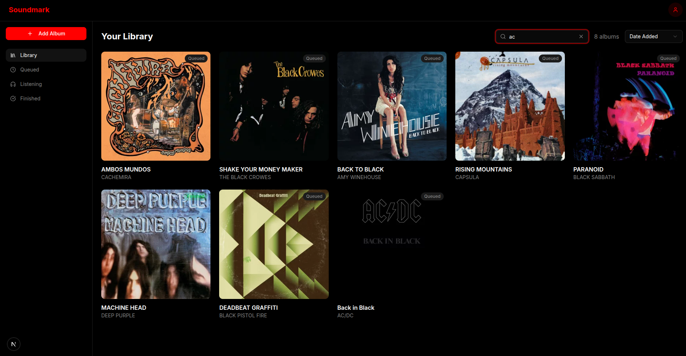
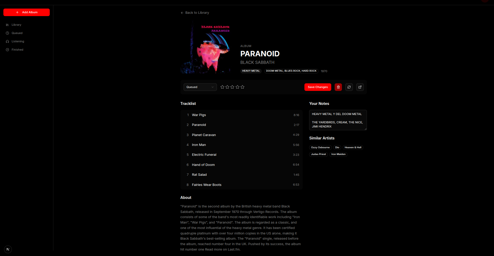

# Soundmark

A professional-grade music encyclopedia and influence tracker for industry professionals and deep listeners.


## Screenshots




## Features

- **Music Library Tracking** - Track albums with status (queued, listening, listened) and 1-5 star ratings
- **Last.fm Integration** - Automatic album metadata, cover art, and genre tagging
- **Artist Discovery** - Search artists and browse their discography
- **User Authentication** - Secure login via Supabase Auth
- **Import/Export** - XLSX spreadsheet import and export for your library

### Future implementations
- Manual editing of the entries

## Prerequisites

Before running this project, you'll need:

- **Node.js 18+** - [Download here](https://nodejs.org/)
- **npm** (comes with Node.js) or **yarn**
- **Supabase account** - [Sign up free](https://supabase.com/dashboard)
- **Last.fm API key** - [Create account](https://www.last.fm/api/account/create)

## Installation

1. Clone the repository:
   ```bash
   git clone https://github.com/yourusername/soundmark-app.git
   cd soundmark-app
   ```

2. Install dependencies:
   ```bash
   npm install
   ```

## Configuration

Create a `.env.local` file in the project root with the following variables:

```env
# Supabase - Get these from your Supabase project settings
NEXT_PUBLIC_SUPABASE_URL=https://your-project-id.supabase.co
NEXT_PUBLIC_SUPABASE_ANON_KEY=your-anon-key

# Last.fm API - Get this from your Last.fm API account
LASTFM_API_KEY=your-lastfm-api-key
```

### Where to find your credentials:

- **Supabase URL & Anon Key**: Go to [Supabase Dashboard](https://supabase.com/dashboard) → Your Project → Settings → API
- **Last.fm API Key**: Create an API account at [Last.fm API](https://www.last.fm/api/account/create)

## Database Setup

1. In your Supabase project, go to the SQL Editor
2. Run the following SQL to create the `music_library` table:

```sql
create table public.music_library (
  id uuid not null default gen_random_uuid (),
  created_at timestamp with time zone null default now(),
  title text not null,
  artist text not null,
  format text null default 'Album'::text,
  genre text null,
  subgenre text null,
  country text null,
  release_year integer null,
  influence_notes text null,
  status text null default 'queued'::text,
  rating integer null,
  constraint music_library_pkey primary key (id),
  constraint music_library_rating_check check (
    (
      (rating >= 1)
      and (rating <= 5)
    )
  )
) TABLESPACE pg_default;
```

3. Enable Row Level Security (RLS) in Supabase for production use

## Running Locally

```bash
# Start development server (http://localhost:3000)
npm run dev

# Build for production
npm run build

# Start production server
npm run start

# Run linting
npm run lint
```

## Project Structure

```
soundmark-app/
├── src/
│   ├── app/                    # Next.js App Router
│   │   ├── (auth)/             # Auth pages (login, signup)
│   │   ├── (dashboard)/        # Protected dashboard pages
│   │   ├── api/                # API routes
│   │   │   ├── lastfm/         # Last.fm proxy endpoints
│   │   │   └── library/        # Import/export endpoints
│   │   └── auth/               # Auth callback handler
│   ├── components/             # React components
│   │   ├── ui/                 # Radix UI primitives
│   │   ├── add-entry/          # Album entry form components
│   │   └── import-export/      # Import/export buttons
│   └── lib/                    # Utilities
│       ├── supabase/           # Supabase client setup
│       ├── lastfm.ts           # Last.fm API wrapper
│       └── utils.ts            # General utilities
├── public/                     # Static assets
```

## Tech Stack

| Category | Technology |
|----------|------------|
| Framework | [Next.js 16](https://nextjs.org/) (App Router) |
| Language | [TypeScript 5](https://www.typescriptlang.org/) |
| Styling | [Tailwind CSS 4](https://tailwindcss.com/) |
| Database | [Supabase](https://supabase.com/) (PostgreSQL) |
| Auth | [Supabase Auth](https://supabase.com/auth) |
| UI Components | [Radix UI](https://www.radix-ui.com/) |
| Music Data | [Last.fm API](https://www.last.fm/api) |
| Spreadsheets | [SheetJS (xlsx)](https://sheetjs.com/) |

## License

This project is licensed under the MIT License - see below for details:

```
MIT License

Copyright (c) 2026 Soundmark

Permission is hereby granted, free of charge, to any person obtaining a copy
of this software and associated documentation files (the "Software"), to deal
in the Software without restriction, including without limitation the rights
to use, copy, modify, merge, publish, distribute, sublicense, and/or sell
copies of the Software, and to permit persons to whom the Software is
furnished to do so, subject to the following conditions:

The above copyright notice and this permission notice shall be included in all
copies or substantial portions of the Software.

THE SOFTWARE IS PROVIDED "AS IS", WITHOUT WARRANTY OF ANY KIND, EXPRESS OR
IMPLIED, INCLUDING BUT NOT LIMITED TO THE WARRANTIES OF MERCHANTABILITY,
FITNESS FOR A PARTICULAR PURPOSE AND NONINFRINGEMENT. IN NO EVENT SHALL THE
AUTHORS OR COPYRIGHT HOLDERS BE LIABLE FOR ANY CLAIM, DAMAGES OR OTHER
LIABILITY, WHETHER IN AN ACTION OF CONTRACT, TORT OR OTHERWISE, ARISING FROM,
OUT OF OR IN CONNECTION WITH THE SOFTWARE OR THE USE OR OTHER DEALINGS IN THE
SOFTWARE.
```
